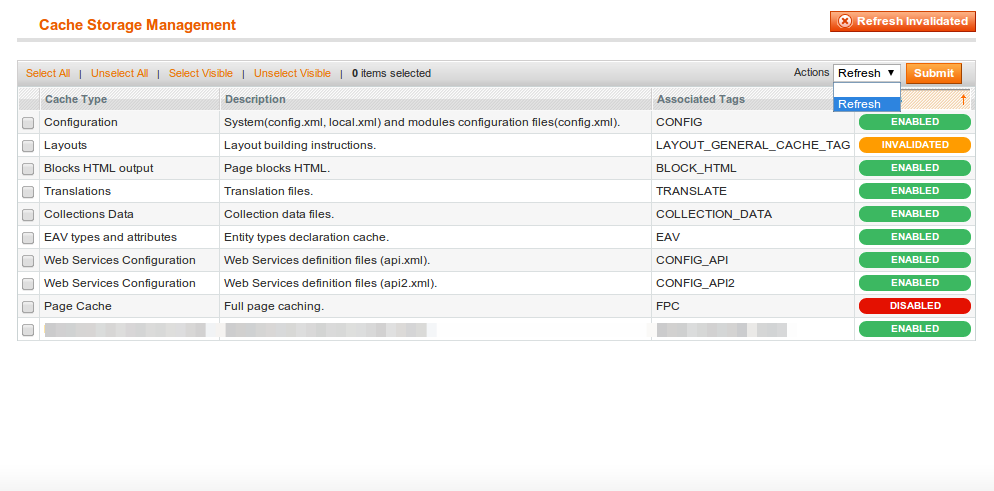

======================================
IMI_EasyCacheRefresh Magento Extension
======================================

The module adds a button "Refresh invalidated" to "System > Cache" to refresh all invalidated caches.
In addition it adds an ACL "limited cache management" for users who can only use the refresh function but not disable
or enable caches.

Limited cache management means:

    -   No "Flush Magento Cache" functionality
    -   No "Clear Cache Storeage" functionality
    -   No Javascript/CSS & Media Flush functionality

Facts
-----

-  version: 0.1.0
-  `extension on
   GitHub <https://github.com/iMi-digital/imi_easycacherefresh>`_

Requirements
------------

-  PHP >= 5.2.0
-  Mage\_Core

Compatibility
-------------

-  Magento >= 1.4

Installation Instructions
-------------------------

1. Install using composer or modman.

Uninstallation
--------------

1. Remove all extension files from your Magento installation

Support
-------

If you have any issues with this extension, open an issue on
`GitHub <https://github.com/iMi-digital/imi_easycacherefresh/issues>`_.

Contribution
------------

Any contribution is highly appreciated. The best way to contribute code
is to open a `pull request on
GitHub <https://help.github.com/articles/using-pull-requests>`_.

Developer
---------

| iMi digital GmmbH
| `http://www.imi-digital.de <http://www.imi-digital.de>`_

License
-------

`OSL - Open Software Licence
3.0 <http://opensource.org/licenses/osl-3.0.php>`_

Copyright
---------

|copy| 2014 iMi digital GmbH

.. |copy|   unicode:: U+000A9 .. COPYRIGHT SIGN

About Us
--------

`iMi digital GmbH` <(http://www.imi.de/>_ offers several types of Magento related open source modules. If you are confrontated with any bugs, you may want to open an issue here.
In need of support or an implementation of a modul in an existing system, `free to contact us` <mailto:digital@iMi.de>. In this case, we will provide full service support for a fee.
Of course we provide development of closed-source moduls as well.

IMI_EasyCacheRefresh Magento Modul
==================================

Das Modul fügt dem Menü "System < Cache" einen Button "Refresh invalidated" hinzu um alle ungültig gewordenen Caches neu aufzubauen.
Zusätzlich fügt es die ACL "limited cache management" hinzu für Benutzer welche Caches nur neu Aufbauen, jedoch nicht
an- oder ausschalten können sollen.

"Limited cache management" bedeudet

    -   Kein "Flush Magento Cache"
    -   Kein "Clear Cache Storeage"
    -   Keine Javascript/CSS & Media Flush Funktion

Anforderungen
-------------

-  PHP >= 5.2.0
-  Mage\_Core

Kompatibilität
--------------

-  Magento >= 1.4

Installation
------------

1. Bitte via composer oder modman installieren.

Deinstallation
--------------

1. Entfernen Sie alle Extension Dateien aus der Magento instsllation

Support
-------

Wenn Sie probleme mit der Extension haben, öffnen Sie bitte ein Support Ticket
`GitHub <https://github.com/iMi-digital/imi_easycacherefresh/issues>`_.

Beitragen
---------

Jeder Beitrag wird gerne gesehen. Der beste weg Code beizusteuern ist durch das öffnnen eines Pull Requests auf
GitHub <https://help.github.com/articles/using-pull-requests>`_.

Entwickler
----------

| iMi digital GmmbH
| `http://www.imi-digital.de <http://www.imi-digital.de>`_

Lizenz
------

`OSL - Open Software Licence
3.0 <http://opensource.org/licenses/osl-3.0.php>`_

Copyright
---------

|copy| 2014 iMi digital GmbH

.. |copy|   unicode:: U+000A9 .. COPYRIGHT SIGN

Über uns
--------

`iMi digital GmbH` <(http://www.imi.de/>_ bietet eine breite Auswahl an verschiedenen Open-Source-Module für Magento an.
Beim Auftreten von Fragen oder Bugs kann hier sehr gerne ein Thread geöffnet werden.

`Kontaktieren Sie uns` <mailto:digital@iMi.de>_ gerne, wenn Sie Support für die Implementierung eines Moduls in ein
bereits bestehendes Shop-System benötigen.In diesem Fall bieten wir einen kostenpflichtigen Full-Service-Support an.

Screenshots
-----------

.. image:: doc/screenshots/full_view.png

.. image:: doc/screenshots/permissions_view.png
